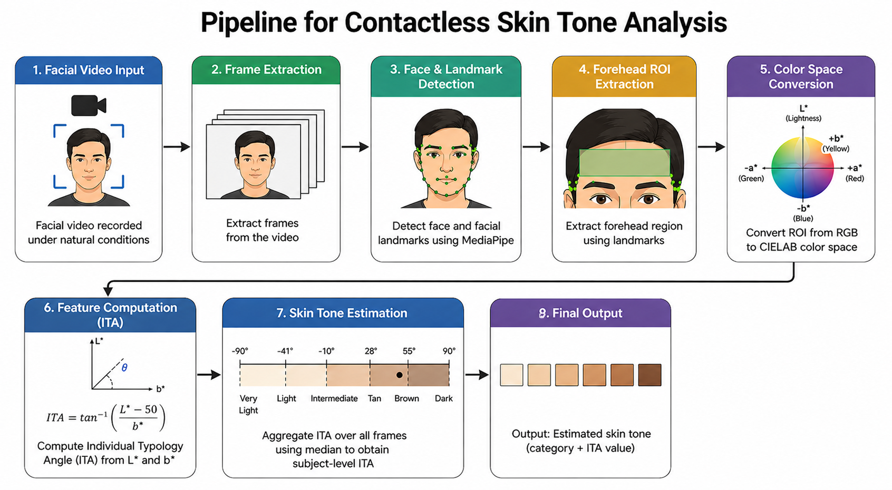
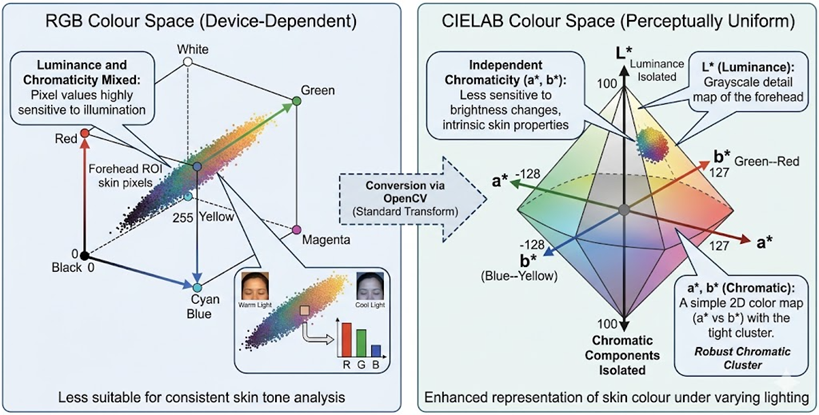
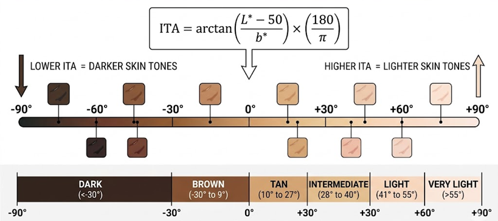
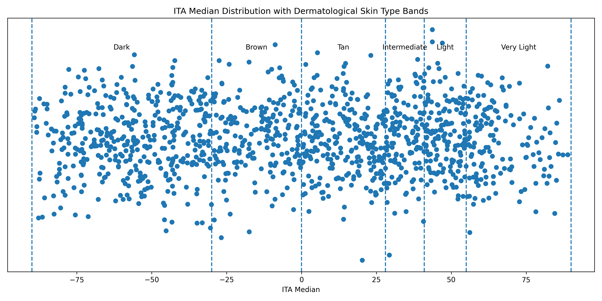
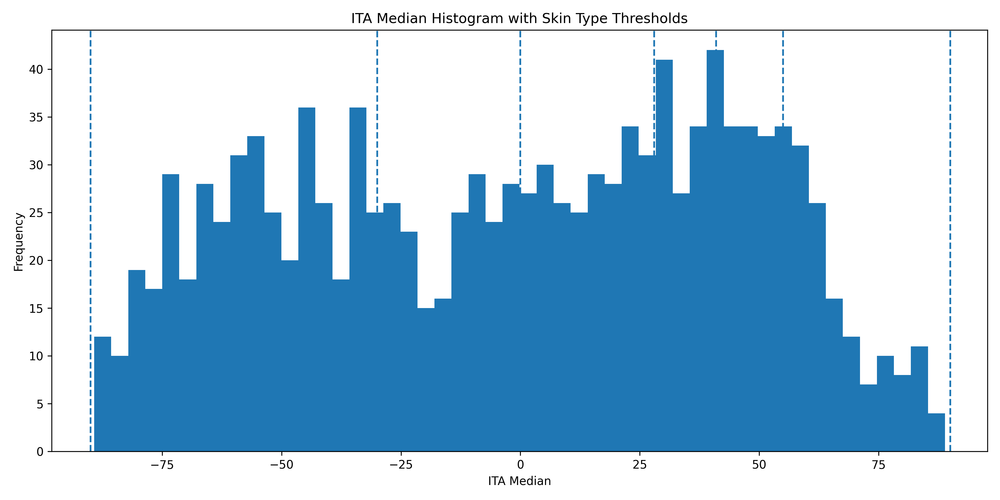
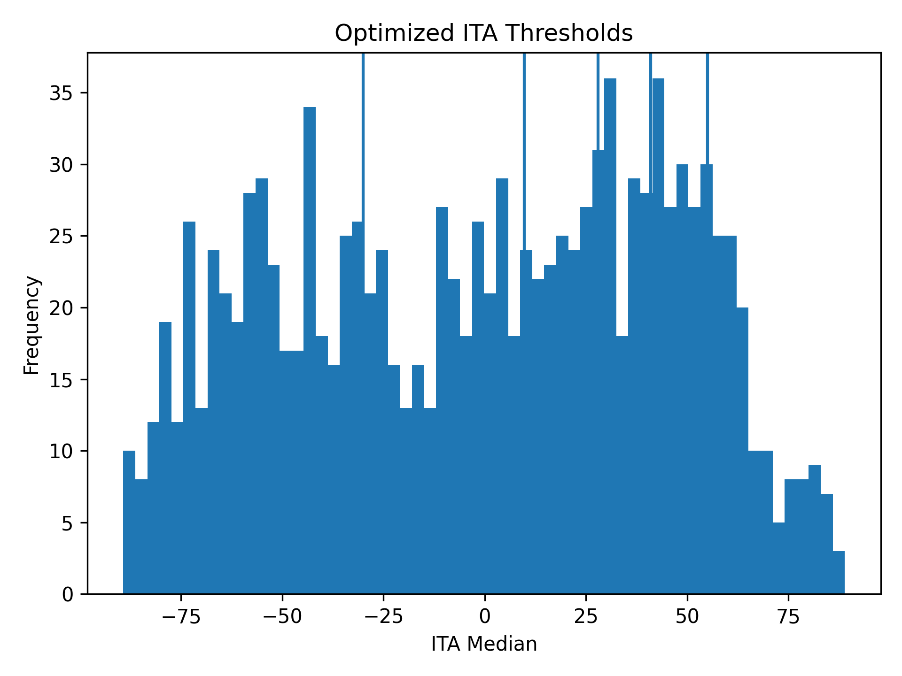
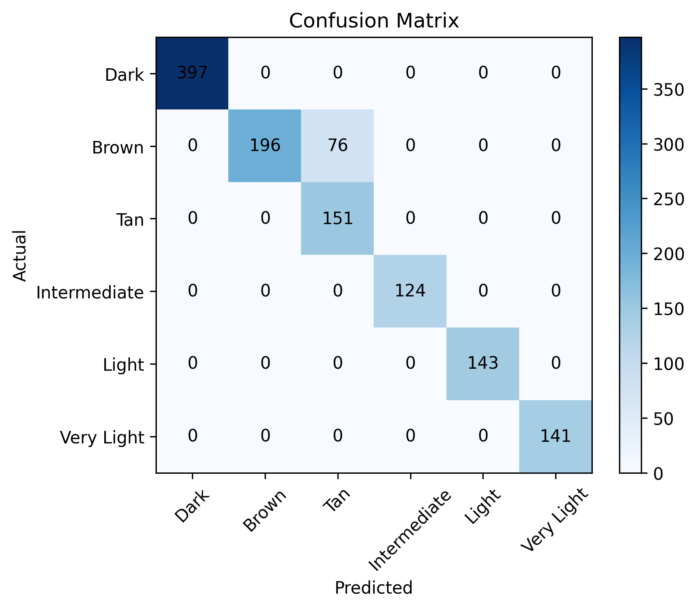

# Camera-Based Facial Skin-Tone Identification Using Video Reflectance Analysis Across Diverse Indian Skin Tones

[](https://www.python.org/)
[]()
[]()
[]()

> **An objective, lightweight, and non-contact framework designed to benchmark facial skin-tone diversity, mitigating demographic and algorithmic bias in camera-based physiological sensing systems (rPPG).**

---

## 🩺 The Health-Tech Core: Why This Matters

Camera-based physiological monitoring—such as **remote photoplethysmography (rPPG)** and non-contact pulse oximetry—relies heavily on tracking subtle periodic color changes in human skin tissue driven by the cardiac cycle. 

However, a fundamental barrier persists in modern biomedical computer vision:
* **The Melanin Challenge:** Melanin heavily modulates light-tissue interactions. High melanin concentrations absorb significant ambient light, rendering rPPG signals weak, noisy, or corrupted for individuals with darker skin tones.
* **The Legacy Gap:** Traditional health metrics rely on the highly subjective **Fitzpatrick Skin Phototype scale**, which fails to accurately represent global tonal breadth, especially across the diverse Indian demographic.

This repository introduces a **fully contactless, mathematically rigorous, and device-independent pipeline** that uses standard video data to calculate a subject's skin tone objectively using the **Individual Typology Angle (ITA)**. By introducing standardized skin-tone indicators, this framework allows health-tech pipelines to dynamically adjust signal processing parameters to ensure equitable diagnostic accuracy across all populations.

---

## 🧬 System Architecture & Pipeline

Unlike compute-heavy deep learning approaches that rely on heavily skewed training datasets, this system uses a lightweight, deterministic algorithm built on perceptually uniform color spaces.

### End-to-End Workflow


1. **Facial Video Input & Frame Extraction:** Standard video input is unpacked frame-by-frame via `OpenCV` to counter temporal distortions from slight head adjustments or unstable ambient illumination.
2. **Landmark Localization:** A dense `MediaPipe FaceMesh` (468 landmarks) maps structural facial geometry.
3. **Forehead ROI Extraction:** The forehead region is isolated as the core Region of Interest (ROI) to avoid confounds caused by facial hair, cosmetics, or expressions.
4. **Perceptually Uniform Color Space Conversion:** Converts device-dependent RGB pixels to the `CIELAB` model, completely separating luminance (L*) from intrinsic chromatic components (a*, b*).

### Why CIELAB over RGB?


RGB combines luminance and chrominance, making measurements highly sensitive to ambient lighting changes. `CIELAB` isolates lightness (L*), ensuring the chromaticity channels (a*, b*) strictly capture pure tissue reflectance. Melanin is a constant, non-transient anatomical feature found strictly within the DC component of skin reflectance, rendering frequency filtering unnecessary.

---

## 📊 The Individual Typology Angle (ITA) Continuum

Skin tone categorization is quantified using the mathematically rigorous Individual Typology Angle (ITA), expressed as:

$$ITA = \arctan\left(\frac{L^* - 50}{b^*}\right) \times \left(\frac{180}{\pi}\right)$$



### Dermatological Thresholds & Optimized Boundary Calibration
The pipeline evaluates individuals across 6 core dermatological classes. Standard thresholds encounter classification errors at the ambiguous transitional boundary between the **Brown** and **Tan** classes. By statistically optimizing the boundary to $ITA = -9.8^\circ$, classification accuracy significantly climbs:

* **Baseline Accuracy:** 93.81%
* **Optimized Accuracy:** **97.50%** (specifically fine-tuned to capture the structural nuances of Indian demographics)

| ITA Range | Skin Tone Category | Optimized Range (Ours) |
| :--- | :--- | :--- |
| $ITA > 55^\circ$ | Very Light | $ITA > 55^\circ$ |
| $28^\circ < ITA \le 55^\circ$ | Light | $28^\circ < ITA \le 55^\circ$ |
| $10^\circ < ITA \le 28^\circ$ | Intermediate | $15^\circ < ITA \le 28^\circ$ |
| $-10^\circ < ITA \le 10^\circ$ | Tan | **$-9.8^\circ < ITA \le 15^\circ$** |
| $-30^\circ < ITA \le -10^\circ$ | Brown | **$-30^\circ < ITA \le -9.8^\circ$** |
| $ITA \le -30^\circ$ | Dark | $ITA \le -30^\circ$ |

*(Note: Standard values extracted from dermatological colorimetric norms).*

### 🧬 Unsupervised Boundary Discovery via HDBSCAN
Rather than guessing transitional boundaries, the adjustment of the **Brown-Tan** threshold to $-9.8^\circ$ was guided by data-driven exploratory mining. 

By applying **HDBSCAN (Hierarchical Density-Based Spatial Clustering of Applications with Noise)** on the extracted 1D time-series ITA vector densities, we isolated true demographic color clusters without introducing artificial classification bias. HDBSCAN exposed a natural density valley between the traditional dermatological thresholds of $-10^\circ$ and $10^\circ$. Locking our deterministic classification cutoff at this exact statistical valley ($ITA = -9.8^\circ$) directly reduced cross-boundary classification errors, boosting diagnostic pipeline matching accuracy to **97.50%**.

---

## 📈 Dataset Insights & Validation

The framework was comprehensively validated under the supervision of the **Centre for Development of Advanced Computing (C-DAC), Chennai**, utilizing a robust database containing facial video sequences of **1,228 subjects** captured under natural indoor lighting profiles.

### Distribution Plots & Performance Matrices

| ITA Median Scatter Distribution | Threshold Histograms | Boundary Optimization Matrix |
| :---: | :---: | :---: |
|  |  |  |

#### Confusion Matrix Alignment


The heavy diagonal dominance confirms high stability and robustness across underrepresented populations, showing flawless separation at the extreme spectrum limits.

---

## 💻 Tech Stack & Environment

The framework runs strictly on a lightweight environment, bypassing the requirement for expensive graphical hardware or training loops:

* **Core Language:** Python
* **Video Processing & Color Conversion:** OpenCV (`cv2.cvtColor`, `cv2.COLOR_BGR2Lab`)
* **Landmark Mesh Tracking:** MediaPipe FaceMesh
* **Vectorized Math & Analytics:** NumPy, Pandas, Scikit-Learn

---

## 🤝 Acknowledgments & Support

This work is supported by the Centre for Development of Advanced Computing (C-DAC), Chennai, an autonomous society established by the Ministry of Electronics & Information Technology (MeitY), Government of India. Special thanks to C-DAC for providing the essential laboratory infrastructure and experimental supervision.

---

## 🚀 Core Processing Architecture

The core framework calculates the median Individual Typology Angle (ITA) across a frame-by-frame time-series matrix. It features integrated OpenCV standard colorimetric value scaling corrections and geometric verification steps.

### Implementation Blueprint

```python
import os
import cv2
import numpy as np
import pandas as pd
import mediapipe as mp

# Initialize MediaPipe Face Mesh
mp_face_mesh = mp.solutions.face_mesh
face_mesh = mp_face_mesh.FaceMesh(static_image_mode=False, max_num_faces=1)

# Forehead ROI Landmarks indices mapping based on MediaPipe structural map
FOREHEAD_IDX = [10, 338, 297, 332, 284, 251, 21, 54, 103, 67, 109]
VIDEO_DIR = "data/videos/"

def process_video(video_path, subject_id):
    cap = cv2.VideoCapture(video_path)
    ita_values = []
    frames_used = 0

    while cap.isOpened():
        ret, frame = cap.read()
        if not ret:
            break

        h, w, _ = frame.shape
        rgb = cv2.cvtColor(frame, cv2.COLOR_BGR2RGB)
        results = face_mesh.process(rgb)

        if results.multi_face_landmarks:
            lmks = results.multi_face_landmarks[0]
            pts = [(int(lmks.landmark[i].x * w), 
                    int(lmks.landmark[i].y * h)) for i in FOREHEAD_IDX]

            x_min, x_max = min(p[0] for p in pts), max(p[0] for p in pts)
            y_min, y_max = min(p[1] for p in pts), max(p[1] for p in pts)
            
            roi = frame[y_min:y_max, x_min:x_max]
            if roi.size == 0:
                continue

            # Convert ROI to LAB Color Space
            lab = cv2.cvtColor(roi, cv2.COLOR_BGR2LAB)

            # OpenCV LAB scale alignment corrections
            L = np.mean(lab[:,:,0]) * (100 / 255)  # Scale to true 0-100 range
            a = np.mean(lab[:,:,1]) - 128          # Center channel chrominance
            b = np.mean(lab[:,:,2]) - 128          # Center channel chrominance

            # Prevent division-by-zero anomalies in dark/saturated environments
            if abs(b) < 1e-6:
                continue

            # Core Mathematical ITA Calculation 
            ita = np.degrees(np.arctan((L - 50) / b))
            ita_values.append(ita)
            frames_used += 1

    cap.release()

    if frames_used < 100:
        print(f"⚠️ Skipped {subject_id} (insufficient frames for robust temporal tracking)")
        return None

    return {
        "Subject_ID": subject_id,
        "Frames_Used": frames_used,
        "ITA_Mean": np.mean(ita_values),
        "ITA_Median": np.median(ita_values)  # Metric chosen to reduce lighting artifact bias
    }

if __name__ == "__main__":
    results = []
    if not os.path.exists(VIDEO_DIR):
        print(f"❌ Target directory not found. Please place subject sequences inside: '{VIDEO_DIR}'")
    else:
        for file in sorted(os.listdir(VIDEO_DIR)):
            if not file.endswith(".mp4"):
                continue

            subject_id = file.replace(".mp4", "")
            video_path = os.path.join(VIDEO_DIR, file)

            print(f"🔄 Processing Cohort Subject: {subject_id}")
            row = process_video(video_path, subject_id)
            if row:
                results.append(row)

        df = pd.DataFrame(results)
        df.to_csv("skin_tone_classification_output.csv", index=False)
        print("✅ Analysis Pipeline Run Complete. Output logs saved to 'skin_tone_classification_output.csv'.")

---
